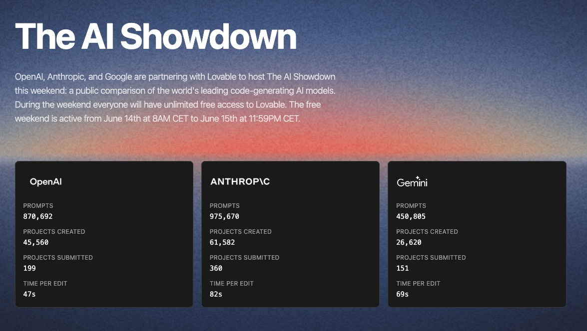

# Posts

### [Welcome to the Year of Loong](posts/welcome-to-the-year-of-loong/index.llms.md)

Welcoming Chinese New Year 2024 — and why the mythical creature should be called ‘loong’, not ‘dragon’.

Feb 11, 2024

Tianyun Wu

1 min

### [Reading Notes - 2024/02/11](posts/2024-02-11-reading-notes/index.llms.md)

Reading notes on Kent Beck’s Extreme Programming Explained — on reconciling humanity and productivity in software development.

Feb 11, 2024

Tianyun Wu

1 min

[View all posts →](all-posts.llms.md)

# Microblogs

A quick take on trying out Lovable, the AI-powered app builder, during their weekend promotion.

Jun 15, 2025

Tianyun Wu

[View all microblogs →](all-microblogs.llms.md)
